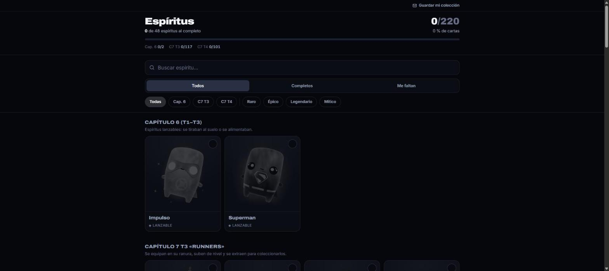
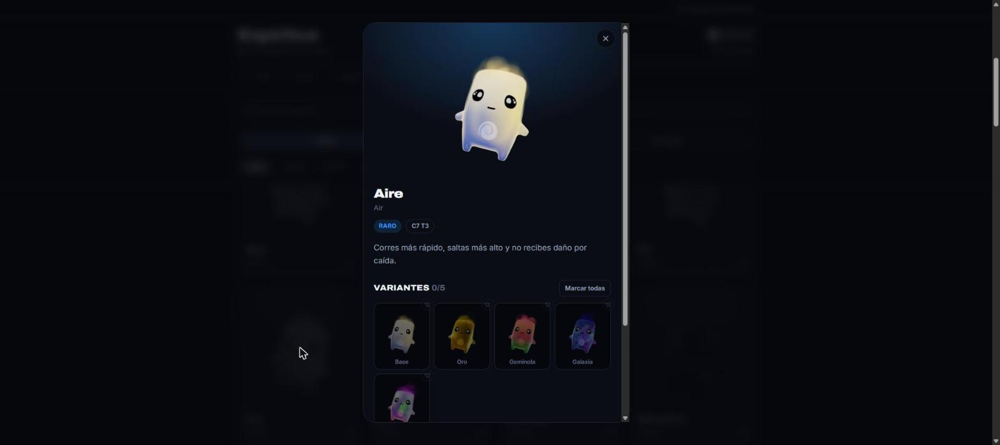

<div align="center">

# 👻 Espíritus Fortnite

**El tracker no oficial de espíritus de Fortnite.** Marca qué cartas tienes, cuáles has dominado, y sincronízalas entre dispositivos.

[](https://espiritusfortnite.vercel.app)
[](https://react.dev)
[](https://www.typescriptlang.org)
[](https://vite.dev)
[](https://tailwindcss.com)
[](https://supabase.com)
[](#-pwa)

</div>

<br>

<p align="center">
  
  
</p>

## Qué es esto

Fortnite ha tenido **48 espíritus** repartidos en tres temporadas (Capítulo 6, Capítulo 7 T3 «Runners» y Capítulo 7 T4 «Override»), cada uno con su propio set de cartas y variantes (base, oro, gominola, galaxia, holofoil, gema...). No hay ninguna forma oficial de llevar la cuenta de cuáles tienes y cuáles te faltan — así que esta app lo hace.

- 📋 **220 cartas coleccionables** con arte propio, agrupadas por temporada y espíritu.
- ✅ Cada carta pasa por tres estados con un solo toque: **no la tienes → la tienes → la has dominado**.
- 🔁 **Sin duplicados entre temporadas**: si un espíritu reaparece con el mismo nombre en otra temporada (Agua, Tierra, Aire), cuenta como uno solo — lo que ya conseguiste no vuelve a pedirse.
- 🔍 Búsqueda, y filtros por temporada, rareza y progreso (todo / completos / me faltan).
- 📊 Progreso global y por temporada en la cabecera, con contador de cartas dominadas.
- 🔐 **Login sin contraseña** (magic link por email) para guardar la colección en la nube y seguir donde lo dejaste en cualquier dispositivo — o úsala como invitado, guardando solo en local.
- 📱 **Instalable como PWA**, con el arte de los espíritus cacheado para que funcione sin conexión.

## Stack

| | |
|---|---|
| **UI** | React 19 + TypeScript + Tailwind CSS v4 |
| **Build** | Vite 8 (con `vite-plugin-pwa`) |
| **Datos y auth** | Supabase (Postgres + Row Level Security + Auth por magic link) |
| **Email transaccional** | Resend, como SMTP propio de Supabase Auth |
| **Hosting** | Vercel |
| **Lint** | Oxlint |

## Cómo funciona la colección

- **Sin sesión**, la colección vive solo en `localStorage` del dispositivo (modo invitado).
- **Con sesión**, se sincroniza contra una tabla `collection_cards` en Supabase (protegida con RLS: cada usuario solo ve y edita sus propias filas), usando `localStorage` como caché para que la app siga funcionando offline.
- Al iniciar sesión por primera vez se conserva el progreso hecho como invitado; al cambiar entre dos cuentas ya autenticadas, cada una mantiene su propia colección sin mezclarse.

## Empezar en local

```bash
git clone https://github.com/chenifero/espiritus_fortnite.git
cd espiritus_fortnite
npm install
```

Crea un `.env.local` con tu propio proyecto de Supabase (necesario solo para el login/sync; la app funciona en modo invitado sin esto):

```bash
VITE_SUPABASE_URL=https://tu-proyecto.supabase.co
VITE_SUPABASE_PUBLISHABLE_KEY=tu-clave-publica
```

```bash
npm run dev       # servidor de desarrollo
npm run build     # build de producción (tsc -b && vite build)
npm run preview   # sirve el build en local
npm run lint       # oxlint
```

### Base de datos

El esquema vive en `supabase/migrations/`. Con la [CLI de Supabase](https://supabase.com/docs/guides/cli) enlazada a tu proyecto:

```bash
supabase link --project-ref tu-proyecto
supabase db push
```

### Datos de espíritus

`src/data/sprites.ts` es la fuente de verdad de qué espíritus y temporadas existen. El arte y las variantes por espíritu se generan con:

```bash
npm run sprites:fetch   # descarga el arte base desde la Fortnite Wiki
npm run sprites:sync    # reconstruye el manifest a partir de public/sprites
```

## Estructura

```
src/
├── components/    # UI: tarjetas, ficha de variantes, filtros, cabecera de progreso, login
├── data/          # catálogo de espíritus, temporadas, variantes y arte
├── lib/           # colección (local + Supabase), auth, cálculo de progreso, rareza
scripts/           # pipeline de scraping/sincronización del arte
supabase/          # migraciones SQL y config del proyecto
```

## Despliegue

La demo vive en [espiritusfortnite.vercel.app](https://espiritusfortnite.vercel.app), desplegada en Vercel con Supabase y Resend conectados vía [Vercel Marketplace](https://vercel.com/marketplace).

---

<div align="center">

Proyecto de fans, no afiliado con Epic Games. Fortnite y los espíritus son marcas de Epic Games, Inc.

Hecho por [iamsergio.dev](https://iamsergio.dev)

</div>
